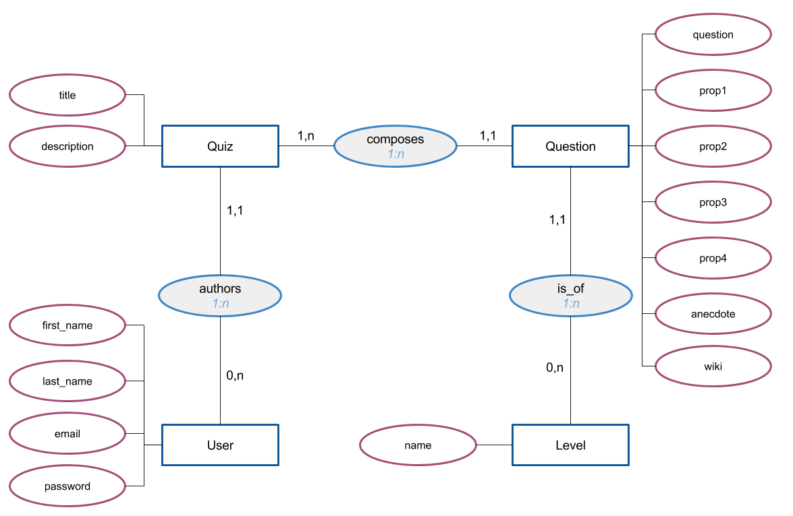

# Objectif
*Développer une interface utilisateur, développer des composants d’accès aux données, développer des pages web en lien avec une base de données*

## Description du projet
**O'Quiz** est une application de quiz.  
En arrivant sur la page d'accueil, les visiteurs voient la liste des quiz disponibles.  
Un lien leur permet également de se connecter.  
En cliquant sur le titre d'un quiz, on consulte le détail d'un quiz.
Sur la page d'un quiz s'affichent les infos du quiz et la liste de questions.  
Les visiteurs non connectés peuvent seulement consulter la liste des questions, alors que les visiteurs connectés peuvent jouer (grâce à un formulaire).   
Lorsqu'un visiteur se connecte il est redirigé vers la page d'accueil (liste des quiz).  
Cliquer sur un quiz permet alors aux visiteurs connectés d'aller jouer:
  - Toutes les questions sont listées sur la page.
  - Pour chaque questions, 4 boutons radio permettent de choisir une des 4 réponses.
  - En bas de la page un bouton permet de soumettre ses réponses et d'afficher son résultat.
A l'affichage du résultat:
  - le score total est affiché (nombre de bonnes réponses / nombre total de questions)
  - chaque question est colorée


```
 /              home : la liste des quiz disponibles
 |_  /quiz/8     page d'un quiz (consulter ou jouer)
 |_  /signup/    inscription
 |_  /signin/    connection
 |_  /compte/    profil user (accessible seulement à l'user connecté)
```

### Tâches principales
* avec phpMyAdmin, créer un utilisateur et une base de données sur laquelle il a tous les droits.  
* importer dans cette BD la structure (`sql/oquiz-struct.sql`) puis les données (`sql/oquiz-data.sql`).
* créez la structure de fichiers dont vous avez besoin pour le projet:
  - utilisez composer pour la gestion des dépendances et le chargement de vos classes
  - Technologies à utiliser:
    - *Pattern* MVC
    - Altorouter (ou autre librairie de routage / choix technique à justifier dans le README)
    - Plates pour la gestion des templates (ou autre librairie de templating / choix technique à justifier dans le README)

### données
* Un quizz est créé par un utilisateur, et est composé de plusieurs questions.
* Chaque question possède 4 propositions, dont une seule correcte. En base de données la réponse correcte est dans le champ `prop1` de la table `questions`.  
* Les questions sont caractérisées par un niveau de difficulté
* La base de données contient également les données relatives aux utilisateurs du site.

Schéma de la base de données :



#### Utilisateurs
2 utilisateurs de test sont déjà inscrits en base de données:
* philippe@oclock.io - quizoclock
* chuck@oclock.io - quizoclock

## Fonctionnalités à développer
  1. la page d'accueil [instructions](docs/page-accueil.md)
  2. la page de consultation d'un quiz [instructions](docs/quiz-consulter.md)
  3. login-logout [instructions](docs/quiz-jeu.md)
  4. le système de quiz! [instructions](docs/quiz-jeu.md)
